# Quick Serve Restaurant (QSR) Use Case - H1000

This use case demonstrates configuring the Intel&reg; RSP H1000 Devkit Sensor and Intel&reg; RSP 
Controller Application as deployed in a typical quick serve restaurant (qsr) environment.

## Table of Contents
1. [Goals](#goals)
2. [Prerequisites](#prerequisites)
3. [Terminology and Concepts](#terminology-and-concepts)
4. [Configure / Control the Intel&reg; RSP Controller Application](#configure--control-the-intelreg-rsp-controller-application)
   1. [Cluster Configuration](#cluster-configuration)
   2. [METHOD 1: Using the Web Admin](#method-1-using-the-web-admin)
   3. [METHOD 2: Using the MQTT Messaging API](#method-2-using-the-mqtt-messaging-api)
5. [Observe Tag Events](#observe-tag-events)
6. [Summary](#summary)
7. [Next Steps](#next-steps)
8. [Starting a Clean Session](#starting-a-clean-session)

## Goals
- Manage a deployment with two separate cold storage rooms, using one H1000 sensor and two antennas.
  - This will be done by assigning a different aliases to each antenna port.
- Know when tagged items come into either cold room.
- Determine the location of a tagged item (sensor and facility).
  - This will be done by setting a facility for the sensor and the aliases for the antenna ports.
- Know when items potentially move between the cold rooms.
  - Using different aliases for the different antennas will generate events when tags move between them.
- Know when items leave either of the cold rooms.
  - This will be done by setting the personality of the sensor to EXIT to determine tag departures.
  
__By the end of this tutorial, you will be able to track tags as they move in and out of the different 
cold rooms.__

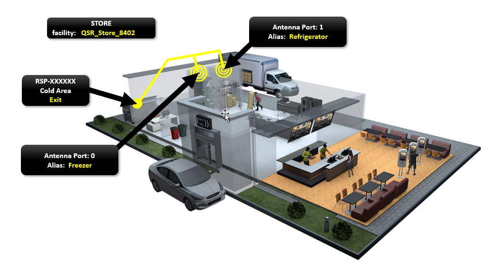

## Prerequisites
1. You have an [H1000 DevKit](https://www.atlasrfidstore.com/intel-rsp-h1000-rfid-reader-development-kit/), 
or an equivalent setup.
    - You will need 1 H1000 sensor device connected with 2 antennas.  Designate (alias) one antenna as "Freezer" and the second antenna as "Refrigerator" (see image above).  It may be helpful to label them so you can easily reference them later in this tutorial.

2. You have completed the setup described in the 
[Get Started with Intel® RFID Sensor Platform on Linux* Guide](https://software.intel.com/en-us/get-started-with-intel-rfid-sensor-platform-on-linux).

3. The Intel&reg; RSP Controller application (hereafter referred to as RSP Controller) is [running](https://software.intel.com/en-us/get-started-with-intel-rfid-sensor-platform-on-linux-run-the-intel-rfid-sensor-platform-controller-application).

4. The H1000 sensor (with two antennas attached to the first two antenna ports) is connected to the RSP Controller.    
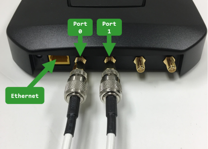

5. Select an RFID tag that is labeled with its value (see image below).  __Place that tag under your computer.__     


6. Remove all other tags from the room.  

7. <div id="phys_setup"></div>The antennas need to be positioned in an optimal setting.  Face them away from each other, point them in different directions, and space them at least 3-5 feet apart (see image below).

    

## Terminology and Concepts
| Term | Definition |
| :------ | :------ |
| Sensor/Device ID | This is the unique identifier for each sensor.  The ID consists of "__RSP-__" followed by the last 6 characters of that sensor's MAC address.  The MAC Address is located on the sensor's label.  Based on the following image, the sensor ID would be RSP-1508e4.   |
| Personality | This is an optional attribute that can be assigned to the sensors. It is utilized by the RSP Controller to generate specific types of tag events. |
| Alias | An alias can be used to identify a specific sensor/antenna-port combination.  This tuple is used to identify the location of tags in the inventory. The alias allows you to give meaningful names (like BackStock or FittingRoom1) for the locations as opposed to using sensor and antenna IDs.  The default value is the sensor ID followed by a hyphen followed by the antenna port number, for example RSP-1508e4-0. |
| Facility | This is used to define zones that consist of one or more sensors.  A typical deployment/location/store will be configured as one facility. |
| Behavior | A collection of low-level RFID settings that dictates how a sensor operates. |
| Cluster | A grouping of one or more sensors that share the same set of configurations (facility, personality, alias, and behavior). |
| Tag State | A particular condition that describes the tag's current status.  The most common states for tags are present, exiting, and departed. |
| Tag Event | This is generated when a tag transitions between states.  The most common events are arrival, departed, and moved. |
| Project Directory | This is the directory where the cloned rsp-sw-toolkit-gw repo contents reside (the default location is ~/projects/).  This directory contains this file and the files required to complete this use-case.  In the following instructions, the default location will be used. |
| Deploy Directory | This is the directory where the Intel&reg; RSP Controller Application gets deployed (the default location is ~/deploy/).  In the following instructions, the default location will be used. |

## Configure / Control the Intel&reg; RSP Controller Application
To configure and use the RSP Controller, one of the main components is the cluster file.  The cluster 
file specifies: 
- How sensors should be grouped together.
- The facility(ies) to be used.
- What aliases should be assigned to the sensors' antenna ports (for unique/custom location reporting using meaningful names).
- Which personalities (if any) should be assigned to the sensors.
- Which behavior settings should be used.

__The cluster configuration file enables you to scale large deployments efficiently and quickly.__

### Cluster Configuration
You will need to edit the __qsr_cluster_config.json__ file __(located at ~/projects/rsp-sw-toolkit-gw/examples/use-cases/qsr/h1000/)__ with new values to set up this use case: we want a single facility; two different aliases, one for each antenna (Freezer and Refrigerator); an EXIT personality; and the appropriate behaviors.

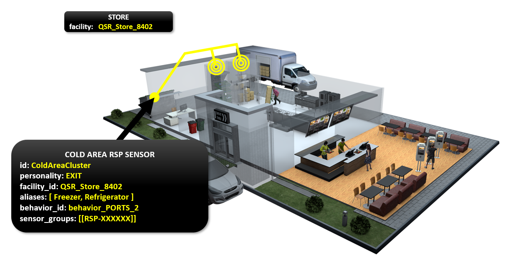

1. Open the the __qsr_cluster_config.json__ file __(located at ~/projects/rsp-sw-toolkit-gw/examples/use-cases/qsr/h1000/)__ in your favorite editor.  You will see that the file is JSON formatted and consists of a cluster configuration ID and a list of clusters.  You will need to insert the appropriate values for each cluster.

2. Edit the various fields to configure the clusters.  The following steps explain each line of the cluster.
    1. __id__: This is a unique ID used to identify this cluster.  You can leave the default value.  
      [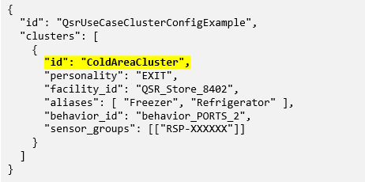](qsr_cluster_config_filled.json)
    2. __personality__: Since we want to know when tags leave any of our locations, we want to set the personality to __"EXIT"__.  This will generate a "departed" event whenever a tag is removed from any of the locations.  
      [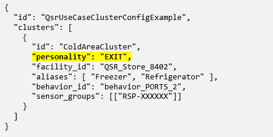](qsr_cluster_config_filled.json)
    3. __facility_id__: For most purposes, a single facility is needed to encompass a deployment at a store.  We will give it the value of our imaginary store's ID.  
      [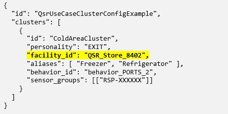](qsr_cluster_config_filled.json)
    4. __aliases__: This is the central configuration piece for setting meaningful names for locations.  In this use case, we're looking to set two locations: the Freezer location, and the Refrigerator location.  We'll assign the antenna hooked up to the first port to be the __"Freezer"__ location, and the antenna hooked up to the second port to be the __"Refrigerator"__ location.  

        __NOTE: The order of the aliases matters.  The first alias will get assigned to the antenna hooked up to the first port, the second alias will be assigned to the antenna hooked up to the second port, etc.  If a value is not specified for a port, then the default alias is used (see the "Alias" term in the [Terminology and Concepts section](#terminology-and-concepts).__  
      [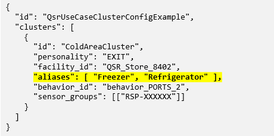](qsr_cluster_config_filled.json)
    5. __behavior_id__: Behaviors are the central configuration piece for the low level RFID configuration settings.  The RSP Controller comes with some preset behavior files, but for this use-case, we will use a custom one by setting the behavior_id to __"behavior_PORTS_2"__.  
      [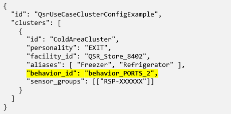](qsr_cluster_config_filled.json)  
       __NOTE:__  The behavior_PORTS_2 file has been optimized for this exercise.  Do NOT use this behavior file for production deployments.
    6. __sensor_groups__: This is where you identify which specific sensors are grouped together.  These sensor groups will be governed by the settings that we just configured in the cluster.  All sensors in each group will run at the same time.  If there are multiple sensor groups per cluster, each group will run sequentially.  In a large deployment, you may have many sensors that could interfere with each other (they cover the same area, they are facing each other, etc.).  You can place them in different groups so that they aren't running at the same time.<br/><br/><div id="sensor_naming"></div>
      In this use-case, we will have one sensor group with a single sensor in it.  __You will need to use your actual sensor's ID in order for the controller application to function properly.__  To find the sensor ID of your sensor, see the label on the back of your sensor (see image below):<br/><br/>
      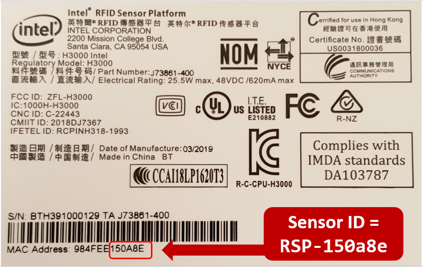<br/>
      __NOTE: Sensor ID = "RSP-XXXXXX" where XXXXXX is the last six characters of the device MAC address.  The last six characters can only consist of numeric values zero through nine and alpha characters A through F [0-9,A-F].  See image above.__<br/><br/><div id="sample_cluster"></div> 
      If done correctly, your cluster configuration file should now look like the following, except with your correct sensor ID:  
        [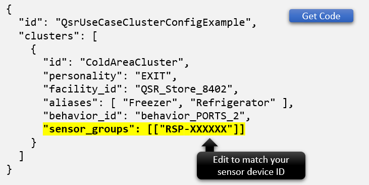](qsr_cluster_config_filled.json)
3. (Optional) Now that the file is complete, it would be a good idea to pass the contents of the file through a JSON linter (such as https://jsonlint.com/, which is a convenient online JSON linting tool) to ensure your file has proper JSON formatting.

4. Save and close the updated cluster configuration file.

5. (Optional) This would be a good time to label your physical antennas with the aliases that you set in the cluster configuration file.  This makes it easier to follow and understand the output when you go through the tag movement/tracking exercise.

6. Choose one of the following methods to configure the RSP Controller. Each method will accomplish 
the same configuration tasks.

    - [METHOD 1: Using the Web Admin](#method-1-using-the-web-admin)
    - [METHOD 2: Using the MQTT Messaging API](#method-2-using-the-mqtt-messaging-api)

___
### METHOD 1: Using the Web Admin
1. Open the [Web Admin](http://localhost:8080/web-admin) and confirm that your sensor 
is connected. This can be seen on the [Dashboard](http://localhost:8080/web-admin/dashboard.html) 
page or the [Sensors](http://localhost:8080/web-admin/sensors-main.html) page.  You can navigate between 
the different pages by using the menu button found at the top left of each page.

    
<br/><br/>
2. On the [Scheduler](http://localhost:8080/web-admin/scheduler.html) page, stop the sensors from reading 
tags by pressing the __INACTIVE__ button.

    
<br/><br/>
3. On the [Inventory](http://localhost:8080/web-admin/inventory-main.html) page, press the __Unload__ button 
to clear out all previous tag history to start a clean session.

    
<br/><br/>
4. On the [Behaviors](http://localhost:8080/web-admin/behaviors.html) page, use the __Upload From File__
button to upload all of the use case behaviors to the RSP Controller.  The behavior file can be found in the __~/projects/rsp-sw-toolkit-gw/examples/use-cases/qsr/h1000/__ directory.  The required file is __behavior_PORTS_2.json__.  
    
 
    __NOTE:__  This file __MUST__ be loaded to the RSP Controller __BEFORE__ the cluster configuration file 
    because the cluster configuration file references this behavior id, and the behavior must already be known by the 
    RSP Controller. Otherwise the loading of the cluster configuration file will fail validation.  

    Your list of behaviors should now include __"behavior_PORTS_2"__:
    
    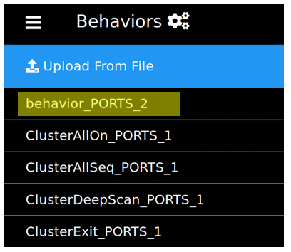
<br/><br/>
5. On the [Cluster Config](http://localhost:8080/web-admin/cluster-config.html) page, use the __Upload From File__ button to upload the __EDITED__ cluster configuration file (see the [Cluster Configuration section](#cluster-configuration)).

    

    The edited cluster configuration file can be found at __~/projects/rsp-sw-toolkit-gw/examples/use-cases/qsr/h1000/qsr_cluster_config.json__ or wherever you saved it from the [Configure / Control the Intel&reg; RSP Controller Application](#configure--control-the-intel-rsp-controller-application) section.

    The cluster ID (ColdAreaCluster) will be displayed.  If you click on the cluster ID name, you should see the values that you set in the cluster configuration file.

      
    __TROUBLESHOOTING:  If your Cluster Config page does not look like the image above then:__
    - Verify you successfully loaded the behavior file in the previous step.
    - Verify your cluster config file is valid.
        - Ensure your cluster config file has proper JSON formatting using the [JSON Linting tool](https://jsonlint.com/).
        - Make sure the values for the Sensor IDs follow the "RSP-XXXXXX" [naming convention](#sensor_naming).
        - Make sure to capitalize the word "EXIT" for the EXIT personality.
        - Make sure the only differences between your cluster config file and the [sample seen above](#sample_cluster) are your Sensor IDs.
    - Try maximizing your browser window.
<br/><br/>
6. On the [Scheduler](http://localhost:8080/web-admin/scheduler.html) page, start the sensor reading 
according to the cluster configuration by pressing the __FROM_CONFIG__ button.

    
    
    The __Cluster Id__, __Behavior__ name and __Sensor__ ID will be displayed on the page (see image below).

    
<br/><br/>
7. On the [Sensors](http://localhost:8080/web-admin/sensors-main.html) page, confirm that the sensor has 
been configured as specified in the cluster configuration file (has the correct behavior, facility, personality, 
and aliases) and is reading tags.  Your sensor page should look like the following except with your respective sensor ID.

    
  
      Connected  
       Disconnected  
       Reading tags
   
   __TROUBLESHOOTING:  If your sensor page does not look like the image above then:__
     - __Make sure the cluster configuration file is valid.  Check the steps you performed in the [Configure / Control the Intel&reg; RSP Controller Application](#configure--control-the-intel-rsp-controller-application) section.__
     - __Check the steps you performed in the [METHOD 1: Using the Web Admin](#method-1-using-the-web-admin)__
     - __Check our [Frequently Asked Questions](https://01.org/rsp-sw-toolkit/faq-0)__  

8. Navigate to the [Inventory](http://localhost:8080/web-admin/inventory-main.html) page which can be used 
to monitor tag reads and states.
<br/><br/>
9. Continue to the [Observe Tag Events section](#observe-tag-events).
___
### METHOD 2: Using the MQTT Messaging API
1. Edit the __mqtt_set_cluster_config.json__ file  __(located at ~/projects/rsp-sw-toolkit-gw/examples/use-cases/qsr/h1000/)__ replacing __CONTENTS_OF_CLUSTER_CONFIG_GO_HERE__ with the contents of your edited __qsr_cluster_config.json file__ (Make sure you completed the [Cluster Configuration](#cluster-configuration) section).   

    Copy and paste the contents of the mqtt_set_cluster_config.json file through a JSON linter (such as https://jsonlint.com/) to ensure your file has proper JSON formatting. 

    Save and close the __mqtt_set_cluster_config.json__ file. 

2. Open a terminal window and subscribe to the RSP Controller's command response topic in order to monitor the 
command responses.  For the purposes of this exercise, we will call this the __"Response Terminal"__.
    ```bash
    #-- monitor the rpc command responses
    mosquitto_sub -t rfid/controller/response
    ```

3. Open another terminal to send JSON-RPC commands over MQTT to configure and control the RSP Controller.  For the purposes of this exercise, we will call this the __"Command Terminal"__.
    ```bash
    #-- change directory to the examples folder 
    #-- so the example commands work correctly
    cd ~/projects/rsp-sw-toolkit-gw/examples
    ```

4. Inactivate the sensors by stopping the RSP Controller Scheduler.<br>
   Execute the following in the __Command Terminal__:
   ```bash
   #-- stop the scheduler
   mosquitto_pub -t rfid/controller/command -f api/upstream/scheduler_set_run_state_request_INACTIVE.json
   ```

   You should see the following output in the __Response Terminal__:
   ```bash
   {"jsonrpc":"2.0","id":"24","result":{"run_state":"INACTIVE","available_states":["INACTIVE","ALL_ON","ALL_SEQUENCED","FROM_CONFIG"],"clusters":[]}}
   ```

   RSP Sensor(s) LED indicator should show solid yellow color.

4. Unload the inventory data.<br>
   Execute the following in the __Command Terminal__:
   ```bash
   #-- unload the current inventory
   mosquitto_pub -t rfid/controller/command -f api/upstream/inventory_unload_request.json
   ```

   You should see the following output in the __Response Terminal__:
   ```bash
   {"jsonrpc":"2.0","id":"16","result":null}
   ```

5. Load the rfid behavior settings specific to this exercise.<br>
   Execute the following in the __Command Terminal__:
   ```bash
   #-- (lowered power levels as sensors are likely to be interfering)
   mosquitto_pub -t rfid/controller/command -f use-cases/qsr/h1000/mqtt_set_behavior.json
   ```

   You should see the following output in the __Response Terminal__:
   ```bash
   {"jsonrpc":"2.0","id":"1","result":[{"id":"behavior_PORTS_2","operation_mode":"NonContinuous","link_profile":1,"power_level":18.0,"selected_state":"Any","session_flag":"S0","target_state":"A","q_algorithm":"Dynamic","fixed_q_value":10,"start_q_value":7,"min_q_value":3,"max_q_value":15,"retry_count":0,"threshold_multiplier":2,"dwell_time":1000,"inv_cycles":0,"toggle_target_flag":false,"repeat_until_no_tags":false,"perform_select":false,"perform_post_match":false,"filter_duplicates":false,"auto_repeat":false,"delay_time":0,"toggle_mode":"OnInvCycle"}]}
   ```

6. Load (set) the cluster configuration.<br>
   Execute the following in the __Command Terminal__:
   ```bash
   #-- load (set) the cluster configuration
   mosquitto_pub -t rfid/controller/command -f use-cases/qsr/h1000/mqtt_set_cluster_config.json
   ```

   You should see the following output in the __Response Terminal__:
   ```bash
   {"jsonrpc":"2.0","id":"4","result":{"id":"QsrUseCaseClusterConfigExample","clusters":[{"id":"ColdAreaCluster","personality":"EXIT","facility_id":"QSR_Store_8402","aliases":["Freezer","Refrigerator"],"behavior_id":"behavior_PORTS_2","sensor_groups":[["RSP-150659"]],"tokens":[]}]}}
   ```

7. Activate the scheduler in to utilize the settings in the cluster configuraiton.<br>
   Execute the following in the __Command Terminal__:
   ```bash
   #-- activate the scheduler in custom configuration mode
   mosquitto_pub -t rfid/controller/command -f api/upstream/scheduler_set_run_state_request_FROM_CONFIG.json
   ```

   You should see the following output in the __Response Terminal__:
   ```bash
   {"jsonrpc":"2.0","id":"24","result":{"run_state":"FROM_CONFIG","available_states":["INACTIVE","ALL_ON","ALL_SEQUENCED","FROM_CONFIG"],"clusters":[{"id":"ColdAreaCluster","personality":null,"facility_id":null,"aliases":[],"behavior_id":"behavior_PORTS_2","sensor_groups":[],"tokens":[]}]}}
   ```
   RSP Sensor(s) LED indicator will show solid blue or blinking blue color when reading rfid tags.

   __TROUBLESHOOTING:__  
    - If you see an error message when you try to execute any of the commands than:
        - Verify you are in the correct path or directory.  By default, the sample commands are located in the ~/projects/rsp-sw-toolkit-gw/examples directory.  Your directory may differ if you selected a different location.
        - Verify the command was entered correctly.
       
    - If you see an error in the response message (i.e. UNKNOWN error or PARSE_ERROR) or the response message does not match the examples above, verify your mqtt_set_cluster_config.json and mqtt_set_behavior.json files are valid.
        - Make sure your modified cluster configuration file is correct and the JSON format is valid.  See the [Cluster Configuration](#cluster-configuration) section.
        - Ensure you edited the mqtt_set_cluster_config.json file as described in [step 1](#method-2-using-the-mqtt-messaging-api).
  

8. Continue to the [Observe Tag Events section](#observe-tag-events).

___

## Observe Tag Events
1.  Open a terminal window and subscribe to the RSP Controller events MQTT topic in order to monitor 
tag events as produced by the RSP Controller.

    ```bash
    #-- monitor the upstream events topic
    mosquitto_sub -t rfid/controller/events
    ```

    __NOTE:__  All of the output seen below is based on the default values from the included configuration files.  
If you changed the default values, your results may differ slightly.

2. ### Tag arrival in the first cold room
    At this point, remove one tag from hiding and place it nearby one of the two antennas. When the tag is  
    read initially, an arrival event will be generated on the rfid/controller/events MQTT topic. 
    Verify from the Web Admin 
    [inventory](http://localhost:8080/web-admin/inventory-main.html) page that the tag is now in the 
    EXITING state and the location is at the first antenna's alias (either Freezer or Refrigerator).

    Verify the receipt of the MQTT event message.
    
    ```json
    {
      "jsonrpc": "2.0",
      "method": "inventory_event",
      "params": {
        "sent_on": 1559867406651,
        "device_id": "intel-acetest",
        "data": [
          {
            "facility_id": "QSR_Store_8402",
            "epc_code": "303530C29C000000F0006B12",
            "tid": null,
            "epc_encode_format": "tbd",
            "event_type": "arrival",
            "timestamp": 1559867406524,
            "location": "Freezer"
          }
        ]
      }
    }
    ```

    If you do not see the expected event, please confirm that
    - The cluster file was edited properly with the correct sensor ID (see the [Cluster Configuration 
    section](#cluster-configuration))
    - The cluster file was uploaded correctly
    - The scheduler is using that cluster configuration

3. ### Tag moved to the other cold room
    Now take the tag and move it to the other antenna. Since these antennas are in the same facility, a 
    moved event will be generated. It may take a few moments for the event to be generated as the 
    algorithm uses time-weighted RSSI averages to determine tag location. From the 
    [inventory](http://localhost:8080/web-admin/inventory-main.html) page, confirm that the tag's location 
    has changed to the other cold room.

    Verify the receipt of the MQTT event message.
    
    ```json
    {
      "jsonrpc": "2.0",
      "method": "inventory_event",
      "params": {
        "sent_on": 1559867488229,
        "device_id": "intel-acetest",
        "data": [
          {
            "facility_id": "QSR_Store_8402",
            "epc_code": "303530C29C000000F0006B12",
            "tid": null,
            "epc_encode_format": "tbd",
            "event_type": "moved",
            "timestamp": 1559867487834,
            "location": "Refrigerator"
          }
        ]
      }
    }
    ```

4. ### Tag departure from the second cold room
    Now take the tag and hide it such that it can't be seen by either antenna.  After the departure 
    threshold time limit has passed (default being 30 seconds), a departed event should be generated 
    for the tag that was removed.  From the [inventory](http://localhost:8080/web-admin/inventory-main.html) 
    page, confirm that the tag state of the removed tag has changed to DEPARTED_EXIT.  
    
    Verify the receipt of the MQTT event message.
    
    ```json  
    {
      "jsonrpc": "2.0",
      "method": "inventory_event",
      "params": {
        "sent_on": 1559867527713,
        "device_id": "intel-acetest",
        "data": [
          {
            "facility_id": "QSR_Store_8402",
            "epc_code": "303530C29C000000F0006B12",
            "tid": null,
            "epc_encode_format": "tbd",
            "event_type": "departed",
            "timestamp": 1559867494569,
            "location": "Refrigerator"
          }
        ]
      }
    }
    ```
## Summary
 Congratulations!  You have completed this tutorial that demonstrates how to configure the Intel&reg; RSP solution for a typical QSR deployment.

By applying the cluster configuration setting, you should have seen how to track a tag across various locations and how it generates different events.  You should now have the knowledge and ability to scale for a larger deployment by adding additional sensors. 

## Next Steps
- [Start a clean session](#starting-a-clean-session) and try a different method to configure the RSP Controller:  
  - [METHOD 1: Using the Web Admin](#method-1-using-the-web-admin)  
  - [METHOD 2: Using the MQTT Messaging API](#method-2-using-the-mqtt-messaging-api)  
- Additional information is available in the [Intel&reg; RSP Get Started Guide Next Steps section](https://software.intel.com/en-us/get-started-with-intel-rfid-sensor-platform-on-linux-next-steps)

## Starting a Clean Session
If you would like to start another use case, try another configuration method, or would like to run 
your own scenario, than you will want to start with a clean session for the RSP Controller so that 
old data and configurations do not pollute your next exercise.  In order to do this, follow these steps:

1. Stop the RSP Controller.  If you used the installer to install the RSP Controller, and you used 
the native installation (non-Docker method), than simply press Ctrl+C in the terminal window where 
you ran the installer script.

2. Run the following commands to clear out the old data and configurations
    ```bash
    cd ~/deploy/rsp-sw-toolkit-gw/cache/
    rm -rf *.json

    cd ~/deploy/rsp-sw-toolkit-gw/config/behaviors/
    rm -rf behavior_PORTS_*
    ```

3. Start the RSP Controller by running the following commands
    ```bash
    cd ~/deploy/rsp-sw-toolkit-gw/
    ./run.sh
    ```

Now you should have a clean session from which you can run any new scenario without worry of data 
or configuration pollution.