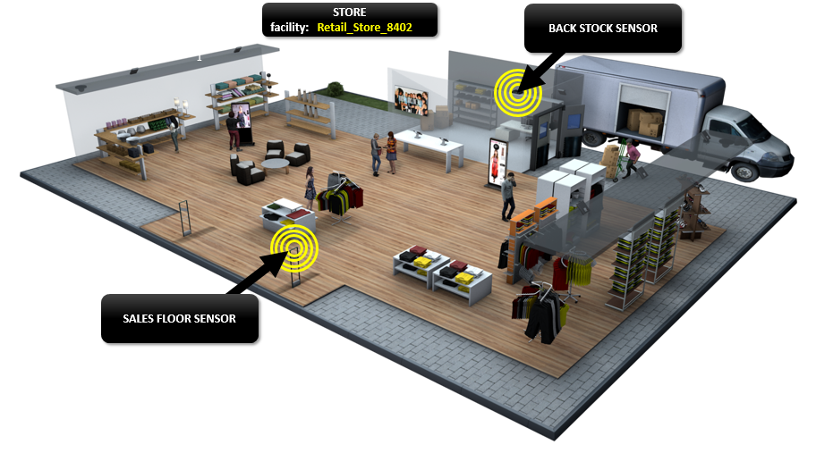
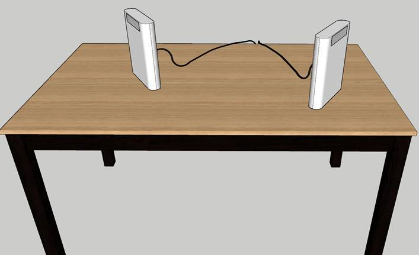
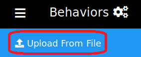

# Retail Use Case - H3000

This use case demonstrates configuring the Intel&reg; RSP H3000 Devkit Sensors and Intel&reg; RSP 
Controller Application as deployed in a typical retail environment.

## Goals  
- Manage a deployment with two separate locations of interest ... BackStock and SalesFloor
  - This will be done by assigning different aliases to the two different sensors
- Know when tagged items come into the store from either location
- Know the location of a tagged item (sensor and facility)
  - This will be done by setting a facility and the aliases for the sensors
- Know when a tagged item has moved from the BackStock to the SalesFloor or vice-versa
  - Using different aliases for the different sensors will generate events when tags move between them
- Know when a tagged item has left the store
  - This will be done by setting the personality of a sensor to EXIT to determine tag departures
  
By the end of the example, you will be able to track a tag as it arrives into the BackStock, 
transitions to the SalesFloor, and then departs out the front door of the store.



## Prerequisites
1. You have an [H3000 DevKit](https://www.atlasrfidstore.com/intel-rsp-h3000-integrated-rfid-reader-development-kit/), 
or an equivalent setup.

2. You have completed the setup described in the 
[Getting Started Guide](https://software.intel.com/en-us/get-started-with-intel-rfid-sensor-platform-on-linux).

3. The Intel&reg; RSP Controller application (hereafter referred to as RSP Controller) is running.

4. The H3000 sensors are connected to the RSP Controller.

5. Select an RFID tag that is labeled with its value.  Place that tag under your computer.  Remove all other tags from the room.  


6. The sensors are positioned in an optimal setting.  Face them away from each other, point them in different 
directions, and space them at least 3-5 feet apart.


## Terminology and Concepts
| Term | Definition |
| :------ | :------ |
| Sensor/Device ID | This is the unique identifier for each sensor.  The ID consists of "RSP-" followed by the last 6 characters of that sensor's MAC address.  The MAC Address is located on the sensor's label.  Based on the following image, the sensor ID would be RSP-1508e4.   |
| Personality | This is an optional attribute that can be assigned to the sensors. It is utilized by the RSP Controller to generate specific types of tag events. |
| Alias | An alias can be used to identify a specific sensor/antenna-port combination.  This tuple is used to identify the location of tags in the inventory. The alias allows you to give meaningful names (like BackStock or FittingRoom1) for the locations as opposed to using sensor and antenna IDs.  The default value is the sensor ID followed by a hyphen followed by the antenna port number, for example RSP-1508e4-0. |
| Facility | This is used to define zones that consist of one or more sensors.  A typical deployment/location will consist of one facility. |
| Behavior | A collection of low-level RFID settings that dictates how the sensor operates. |
| Cluster | A grouping of one or more sensors that share the same set of configurations (facility, personality, alias, and behavior). |
| Tag State | A particular condition that describes the tag's current status.  The most common states for tags are present, exiting, and departed. |
| Tag Event | This is generated when a tag transitions between states.  The most common events are arrival, departed, and moved. |
| Project Directory | This is the directory where the cloned rsp-sw-toolkit-gw repo contents reside (the default location is ~/projects/).  This directory contains this file and the files needed to do this use-case.  In the following instructions, the default location will be used. |
| Deploy Directory | This is the directory where the Intel&reg; RSP Controller Application gets deployed (the default location is ~/deploy/).  In the following instructions, the default location will be used. |


## Configure / Control the Intel&reg; RSP Controller Application
To configure and use the RSP Controller, one of the main components is the cluster configuration file.  The cluster configuration
file specifies: 
- How sensors should be grouped together
- The facility(ies) to be used
- What aliases should be assigned to the sensors' antenna ports (for unique/custom location reporting using meaningful names)
- Which personalities (if any) should be assigned to the sensors
- Which behavior settings should be used

__The cluster configuration file enable you to scale large deployments efficiently and quickly.__

### Cluster Configuration
You will need to edit the [DevkitRetailCluster.json](./DevkitRetailCluster.json) file (located at ~/projects/rsp-sw-toolkit-gw/examples/use-cases/retail/h3000/) with new values to set up this use case: we want a single facility; two different aliases, one for each sensor (BackStock and SalesFloor); an EXIT personality for the sensor labeled as SalesFloor; and the appropriate behaviors.


1. Open the file in your favorite editor.  You will see that the file is JSON formatted and consists of a cluster configuration ID and a list of clusters.  You will need to insert the appropriate values for each cluster.

2. Edit the various fields to configure the clusters.  The following steps explain each line of the cluster.  
See the following for the first cluster:
    1. __id__: This is a unique ID used to identify this cluster.  In this use case we will create two clusers, one for the Back Stock and one for the Sales Floor, similar to what you see below.  You can keep the existing default values from the sample cluster file.    
        ```json
        {
          "id": "RetailUseCaseClusterConfigExample",
          "clusters": [
            {
              "id": "BackStockCluster"
            }, {
              "id": "SalesFloorExitCluster"
            }
          ]
        }
        ```     
    2. __personality__: The location for the first cluster (BackStockCluster) will be internal to the store and doesn't need to be assigned any personality, so we will give it a value of __null__.  The location for the second cluster (SalesFloorExitCluster) is being used to configure an "edge/boundary" location from where tags may leave the facility, we will set the personality to __EXIT__.  This will generate a "departed" event whenever a tag is removed from this cluster's location.
        ```json
        {
          "id": "RetailUseCaseClusterConfigExample",
          "clusters": [
            {
              "id": "BackStockCluster",
              "personality": null
            }, {
              "id": "SalesFloorExitCluster",
              "personality": "EXIT"
            }
          ]
        }
        ```
    3. __facility_id__: For most purposes, a single facility is needed to encompass a deployment at a store.  We will set the facility_id to __Retail_Store_8402__ for both clusters.
        ```json
        {
          "id": "RetailUseCaseClusterConfigExample",
          "clusters": [
            {
              "id": "BackStockCluster",
              "personality": null,
              "facility_id": "Retail_Store_8402"
            }, {
              "id": "SalesFloorExitCluster",
              "personality": "EXIT",
              "facility_id": "Retail_Store_8402"
            }
          ]
        }
        ``` 
    4. __aliases__: This is the central configuration piece for setting meaningful names for locations.  For the first cluster, we will set the aliases to __BackStock__ and for the second cluster, set the aliases to __SalesFloor__.  For enhanced performance, the H3000 sensors have two linear antennas built into the same unit which cover the same location.  Instead of treating the two antennas as separate locations, we configure them as one location by giving them the same alias value per cluster.            
        ```json
        {
          "id": "RetailUseCaseClusterConfigExample",
          "clusters": [
            {
              "id": "BackStockCluster",
              "personality": null,
              "facility_id": "Retail_Store_8402",
              "aliases": [ "BackStock", "BackStock" ]
            }, {
              "id": "SalesFloorExitCluster",
              "personality": "EXIT",
              "facility_id": "Retail_Store_8402",
              "aliases": [ "SalesFloor", "SalesFloor" ]
            }
          ]
        }
        ```  
    5. __behavior_id__: Behaviors are the central configuration piece for the low level RFID configuration settings.  The RSP Controller comes with some preset behavior files, but for this use-case, we will use a custom one by setting the behavior_id for both clusters to __DevkitRetailBehavior_PORTS_1__.
        ```json
        {
          "id": "RetailUseCaseClusterConfigExample",
          "clusters": [
            {
              "id": "BackStockCluster",
              "personality": null,
              "facility_id": "Retail_Store_8402",
              "aliases": [ "BackStock", "BackStock" ],
              "behavior_id": "DevkitRetailBehavior_PORTS_1"
            }, {
              "id": "SalesFloorExitCluster",
              "personality": "EXIT",
              "facility_id": "Retail_Store_8402",
              "aliases": [ "SalesFloor", "SalesFloor" ],
              "behavior_id": "DevkitRetailBehavior_PORTS_1"
            }
          ]
        }
        ``` 
    6. __sensor_groups__: This is where you identify which specific sensors are grouped together.  These sensor groups will be governed by the settings that we just configured in their respective cluster.  All sensors in each group will run at the same time.  If there are multiple sensor groups per cluster, each group will run sequentially.  In a large deployment, you may have many sensors that could interfere with each other (they cover the same area, they are facing each other, etc.).  You can place them in different groups so that they aren't running at the same time.  In this use-case, for each cluster, we will have one sensor group with a single sensor in it.  
    __A sample sensor ID is used below, but for proper functionality, you will have to use your actual sensor's ID.__  To find the sensor ID of your sensor, see the "Sensor/Device ID" term in the [Terminology and Concepts section](#terminology-and-concepts).
        __NOTE: The sensor ID is case sensitive, so make sure the "RSP" portion is capitalized and any other alphabetical characters are lowercase.__
        ```json
        {
          "id": "RetailUseCaseClusterConfigExample",
          "clusters": [
            {
              "id": "BackStockCluster",
              "personality": null,
              "facility_id": "Retail_Store_8402",
              "aliases": [ "BackStock", "BackStock" ],
              "behavior_id": "DevkitRetailBehavior_PORTS_1",
              "sensor_groups": [["<YOUR_SENSOR_ID>"]]
            }, {
              "id": "SalesFloorExitCluster",
              "personality": "EXIT",
              "facility_id": "Retail_Store_8402",
              "aliases": [ "SalesFloor", "SalesFloor" ],
              "behavior_id": "DevkitRetailBehavior_PORTS_1",
              "sensor_groups": [["<YOUR_SENSOR_ID>"]]
            }
          ]
        }
        ```  
3. If done correctly, your cluster configuration file should now look like the following, except with your correct sensor IDs:
    ```json
    {
      "id": "RetailUseCaseClusterConfigExample",
      "clusters": [
        {
          "id": "BackStockCluster",
          "personality": null,
          "facility_id": "Retail_Store_8402",
          "aliases": [ "BackStock", "BackStock" ],
          "behavior_id": "DevkitRetailBehavior_PORTS_1",
          "sensor_groups": [["<YOUR_SENSOR_ID>"]]
        }, {
          "id": "SalesFloorExitCluster",
          "personality": "EXIT",
          "facility_id": "Retail_Store_8402",
          "aliases": [ "SalesFloor", "SalesFloor" ],
          "behavior_id": "DevkitRetailBehavior_PORTS_1",
          "sensor_groups": [["<YOUR_SENSOR_ID>"]]
        }
      ]
    }
    ```  
    __Note: In this instance, although the sensors are in different groups, they are also in different clusters.  Since clusters are independent of each other, both sensors will end up running at the same time, so make sure to space the sensors apart and make them face away from each other as outlined in Step 7 in the [Prerequisites section](#prerequisites).__

4. Now that the file is complete, it would be a good idea to pass the contents of the file through a JSON linter (such as https://jsonlint.com/, which is a convenient online JSON linting tool) to ensure your file has proper JSON formatting.

5. Save and close the updated cluster configuration file.

6. (Optional) This would be a good time to label your physical sensors with their sensor IDs and the aliases that you set in the cluster configuration file.  This will help make it easier to follow and understand the output when you go through the tag movement/tracking exercise.

7. Choose one of the following methods to configure and control the RSP Controller. Each method will accomplish 
the same configuration tasks.

    - [METHOD 1: Using the Web Admin](#method-1-using-the-web-admin)
    - [METHOD 2: Using the MQTT Messaging API](#method-2-using-the-mqtt-messaging-api)

___

### METHOD 1: Using the Web Admin
1. Open the [web admin](http://localhost:8080/web-admin) page and confirm that the sensors included in the 
devkit are connected. This can be seen on the [dashboard](http://localhost:8080/web-admin/dashboard.html) 
page or the [sensors](http://localhost:8080/web-admin/sensors-main.html) page.  You can navigate between 
the different pages by using the menu button found at the top left of each page.

    

2. On the [scheduler](http://localhost:8080/web-admin/scheduler.html) page, stop the sensors from reading 
tags by pressing the INACTIVE button.

    

3. On the [inventory](http://localhost:8080/web-admin/inventory-main.html) page, press the Unload button 
to clear out all previous tag history to start a clean session.

    

4. On the [behaviors](http://localhost:8080/web-admin/behaviors.html) page, use the Upload From File
button to upload all of the use case behaviors to the RSP Controller.

    
    
    The behavior files can be found in the 
    ~/projects/rsp-sw-toolkit-gw/examples/use-cases/retail/h3000/ directory.  The required files are:

    - DevkitRetailBehaviorDeepScan_PORTS_1.json
    - DevkitRetailBehaviorExit_PORTS_1.json

    __NOTE:__  These files __MUST__ be loaded to the RSP Controller __BEFORE__ the cluster configuration 
    because the cluster file references those behavior ids, and the behaviors must already be known by the 
    RSP Controller. Otherwise the loading of the cluster configuration file will fail validation.

5. Upload the __EDITED__ cluster configuration file (see the [Cluster Configuration section](#cluster-configuration)) 
using the [cluster config](http://localhost:8080/web-admin/cluster-config.html) page.

    

    The cluster configuration file can be found at 
    ~/projects/rsp-sw-toolkit-gw/examples/use-cases/retail/h3000/DevkitRetailCluster.json.

6. On the [scheduler](http://localhost:8080/web-admin/scheduler.html) page, start the sensors reading 
according to the cluster configuration by pressing the FROM_CONFIG button.

    
    
    The clusters that the scheduler is using will be displayed on the page.

7. On the [sensors](http://localhost:8080/web-admin/sensors-main.html) page, confirm that the sensors have 
been configured as specified in the cluster configuration file (have the correct behavior, facility, personality, 
and aliases) and are reading tags.

8. Navigate to the [inventory](http://localhost:8080/web-admin/inventory-main.html) page which can be used 
to monitor tag reads and states.

9. Continue to the [Observe Tag Events section](#observe-tag-events).
___

### METHOD 2: Using the MQTT Messaging API
1. Edit [cluster_set_config_request_use_case_retail.json](./cluster_set_config_request_use_case_retail.json) 
replacing "CONTENTS_OF_CLUSTER_CONFIG_GO_HERE" with the contents of the edited DevkitRetailCluster.json file. 

2. Open a terminal window and subscribe to the RSP Controller's command response topic in order to monitor the 
command responses.
    ```bash
    #-- monitor the rpc command responses
    mosquitto_sub -t rfid/controller/response
    ```

3. Open another terminal to send JsonRPC commands over MQTT to configure and control the RSP Controller.
    ```bash
    #-- change directory to the examples folder 
    #-- so the example commands work correctly
    cd ~/projects/rsp-sw-toolkit-gw/examples
    
    #-- stop the scheduler
    mosquitto_pub -t rfid/controller/command -f api/upstream/scheduler_set_run_state_request_INACTIVE.json
    
    #-- unload the current inventory
    mosquitto_pub -t rfid/controller/command -f api/upstream/inventory_unload_request.json
    
    #-- load behaviors specific to this exercise
    #-- (lowered power levels as sensors are likely to be interfering)
    mosquitto_pub -t rfid/controller/command -f use-cases/retail/h3000/behavior_put_request_DeepScan.json
    mosquitto_pub -t rfid/controller/command -f use-cases/retail/h3000/behavior_put_request_Exit.json
    
    #-- load (set) the cluster configuration
    mosquitto_pub -t rfid/controller/command -f use-cases/retail/h3000/cluster_set_config_request_use_case_retail.json
    
    #-- activate the scheduler in custom configuration mode
    mosquitto_pub -t rfid/controller/command -f api/upstream/scheduler_set_run_state_request_FROM_CONFIG.json
    ```

4. Continue to the [Observe Tag Events section](#observe-tag-events).
___

## Observe Tag Events
Open a terminal window and subscribe to the RSP Controller events MQTT topic in order to monitor 
tag events as produced by the RSP Controller.

```bash
#-- monitor the upstream events topic
mosquitto_sub -t rfid/controller/events
```

__NOTE:__  All of the output seen below is based on the default values from the included configuration files.  
If you changed the default values, your results may differ slightly.

1. ### Tag arrival in BackStock
    At this point, remove one tag from hiding and place it nearby the BackStock sensor. 
    When the tag is read initially, an arrival event will be generated on the rfid/controller/events topic.
    Verify from the Web Admin 
    [inventory](http://localhost:8080/web-admin/inventory-main.html) page that the tag is now PRESENT
    and the location is at the BackStock sensor.

    Verify the receipt of the MQTT event message.
    
    ```json
    {
      "jsonrpc": "2.0",
      "method": "inventory_event",
      "params": {
        "sent_on": 1559867406651,
        "device_id": "intel-acetest",
        "data": [
          {
            "facility_id": "Retail_Store_8402",
            "epc_code": "303530C29C000000F0006B12",
            "tid": null,
            "epc_encode_format": "tbd",
            "event_type": "arrival",
            "timestamp": 1559867406524,
            "location": "BackStock"
          }
        ]
      }
    }
    ```

    If you do not see the expected event, please confirm that
    - The cluster file was edited properly with the correct sensor ID (see the [Cluster Configuration 
    section](#cluster-configuration))
    - The cluster file was uploaded correctly
    - The scheduler is using that cluster configuration

2. ### Tag departure from BackStock and arrival in SalesFloor
    Now move the tag from the BackStock sensor to the SalesFloor sensor. Since these sensors are at different 
    locations within the same facility, a "moved" event will be generated.  It may take a few moments for the 
    event to be generated as the algorithm uses time-weighted RSSI averages to determine the tag location. From 
    the [inventory](http://localhost:8080/web-admin/inventory-main.html) page, confirm that the tag has changed 
    locations to the second sensor and that the tag state has changed to EXITING.

    Verify the receipt of the MQTT event message.
    
    ```json  
    {
      "jsonrpc": "2.0",
      "method": "inventory_event",
      "params": {
        "sent_on": 1559867429368,
        "device_id": "intel-acetest",
        "data": [
          {
            "facility_id": "Retail_Store_8402",
            "epc_code": "303530C29C000000F0006B12",
            "tid": null,
            "epc_encode_format": "tbd",
            "event_type": "moved",
            "timestamp": 1559867428832,
            "location": "SalesFloor"
          }
        ]
      }
    }
    ```

3. ### Tag departs
    Hide the tag so that no sensor is able to read it to emulate the tag actually being gone.
    After the departure threshold time limit has passed (default being 30 seconds), a departed 
    event should be generated from the SalesFloor sensor.  From the 
    [inventory](http://localhost:8080/web-admin/inventory-main.html) page, confirm that the state 
    changes to DEPARTED_EXIT.

    Verify the receipt of the MQTT event message.
    
    ```json  
    {
      "jsonrpc": "2.0",
      "method": "inventory_event",
      "params": {
        "sent_on": 1559867527713,
        "device_id": "intel-acetest",
        "data": [
          {
            "facility_id": "Retail_Store_8402",
            "epc_code": "303530C29C000000F0006B12",
            "tid": null,
            "epc_encode_format": "tbd",
            "event_type": "departed",
            "timestamp": 1559867494569,
            "location": "SalesFloor"
          }
        ]
      }
    }
    ```

## Starting a Clean Session
If you would like to start another use case, try another configuration method, or would like to run 
your own scenario, then you will want to start with a clean session for the RSP Controller so that 
old data and configurations do not pollute your next exercise.  In order to do this, follow these steps:

1. Stop the RSP Controller.  If you used the installer to install the RSP Controller, and you used 
the native installation (non-Docker method), then simply press Ctrl+C in the terminal window where 
you ran the installer script.

2. Run the following commands to clear out the old data and configurations
    ```bash
    cd ~/deploy/rsp-sw-toolkit-gw/cache/
    rm -rf *.json
    ```

3. Start the RSP Controller by running the following commands
    ```bash
    cd ~/deploy/rsp-sw-toolkit-gw/
    ./run.sh
    ```

Now you should have a clean session from which you can run any new scenario without worry of data 
or configuration pollution.
